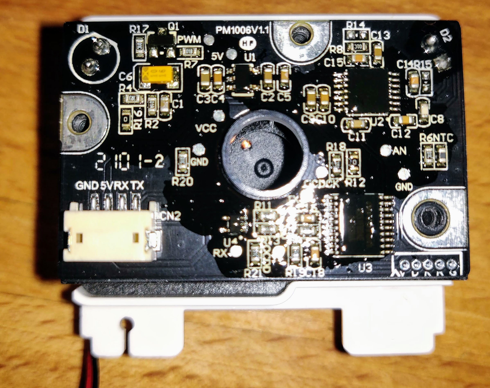
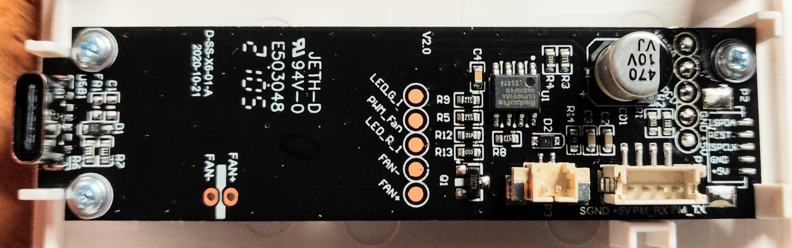
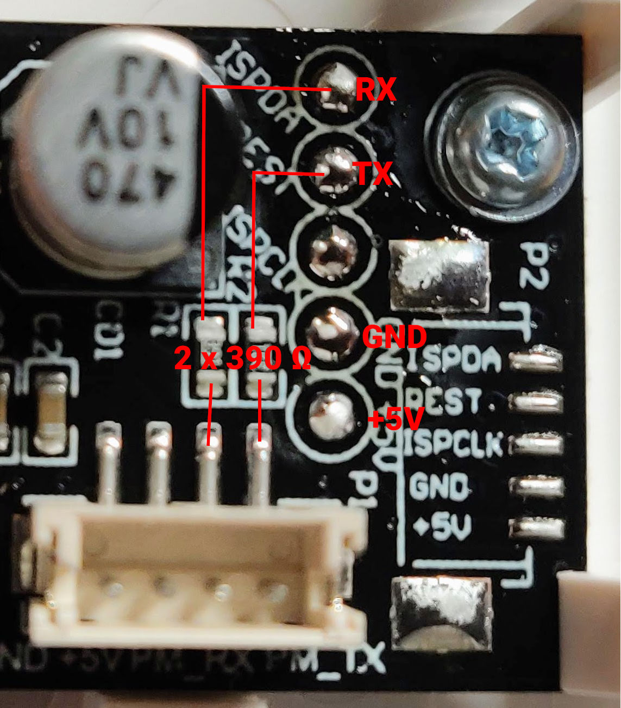
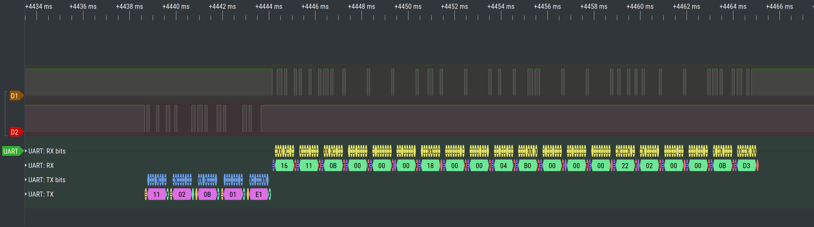

# Vindriktning PM2.5 Sensor Custom Sensor

Based on findings of https://github.com/Hypfer/esp8266-vindriktning-particle-sensor - uses same hardware setup but with a different firmware approach. This one integrates into [esphome](https://github.com/esphome/esphome).

TIL: there is also [another ESPHome integration attempt](https://github.com/Habbie/esphome/tree/pm1006/esphome/components/pm1006) in progress which already looks better integrated. 

## Hardware TL;DR

- Grab a d1 mini, preferably with an usb port (and thus 5V regulator). There seem to be a lot of versions available with slightly different features in that regards.
- Open the IKEA Vindriktning device, notice the testpoints on the edge of the board
- Connect: `v:+5V -> d1:5V`, `v:GND -> d1:G`, `c:REST -> d1:D2`

## ESPHome Integration
I still need to figure out how to make it a "proper" esphome compliant external component. For the time being, you will have to pull the repo, extend the `includes:` property of `esphome:` and register the component using a `lambda:` expression in your configuration file.

Inside your esphome root folder / next to your `my-gadget.yaml` file

```shell
git clone https://github.com/pulsar256/vindriktning_esphome.git 
```

## Configuration

my-gadget.yaml:

```yaml
esphome:
  name: my-gadget
  platform: ESP8266
  board: d1_mini
  includes:
    - vindriktning_esphome/components/vindriktning/vindriktning.h

uart:
  id: uart_bus
  tx_pin: D0
  rx_pin: D2
  baud_rate: 9600

sensor:
- platform: custom
  lambda: |-
    auto my_sensor = new VindriktningSensor(id(uart_bus));
    App.register_component(my_sensor);
    return {my_sensor};
  sensors:
    name: "PM2.5 sensor in the secret underground lab"
    unit_of_measurement: µg/m³
    accuracy_decimals: 0
logger:

# api, ota, wifi, etc config go here.
```

## Working Principle

The IKEA Vindriktning consists of two separate modules

### The PM1006 Sensor



### LED Board




Both board communicate using UART / Serial protocol, 9600 baud, 8n1. The LED board will start a measurement cycle every 20 seconds by turning on the fan and taking 7 readings from the sensor boards. The first two readings are 1 second apart and the following 5 with a spacing of two seconds.

### Request-Response capture



Recently I have also learned that there is a [datasheet](http://www.jdscompany.co.kr/download.asp?gubun=07&filename=PM1006_LED_PARTICLE_SENSOR_MODULE_SPECIFICATIONS.pdf) available for the module.
