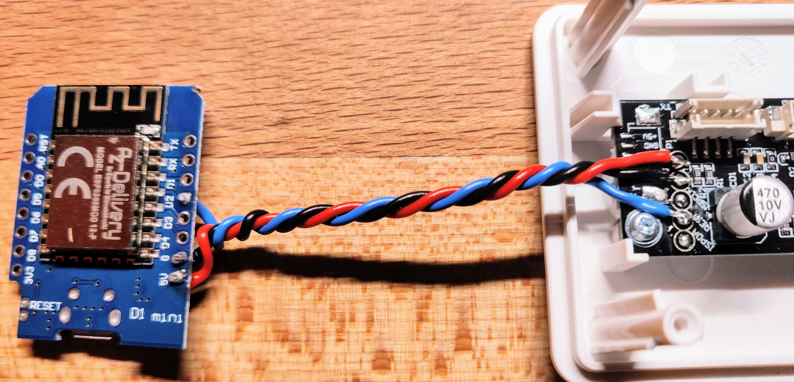
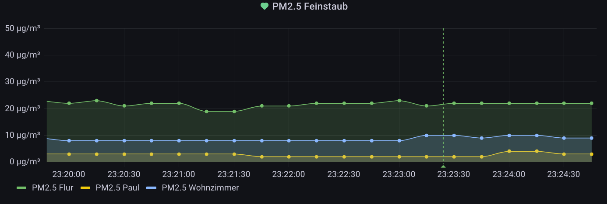

# Vindriktning PM2.5 Sensor Custom Sensor

Capture nummerical readings by tapping into the debug port of a IKEA Vindriktning Air Quality Sensor module and expose the readings to Home Assistant.

This approach does not talk directly to the sensor module but rather listens to the responsens from the PM1006 sensor module sent to the LED board and parses the output. The IKEA Vindriktning will still work as originally intended.

## Prior work and alternative approaches

- https://github.com/Hypfer/esp8266-vindriktning-particle-sensor - uses same hardware setup but with a different firmware approach. I have adapted the physical wiring to make transition easier.
- https://github.com/Habbie/esphome/tree/pm1006/esphome/components/pm1006 is better integrated into the ESPHome ecosystem and will most likely be merged upstream. If in doubt, choose this alternative.

## Hardware TL;DR

- Grab a d1 mini, preferably with an usb port (and thus 5V regulator). There seem to be a lot of versions available with slightly different features in that regards.
- Open the IKEA Vindriktning device, notice the testpoints on the edge of the board
- Connect: `d1:5V -> v:+5V`, `d1:G -> v:GND`, `d1:D2 -> c:REST`



## ESPHome Integration

Inside your esphome root folder / next to your `my-gadget.yaml` file

```shell
git clone https://github.com/pulsar256/vindriktning_esphome.git 
```

## Configuration

my-gadget.yaml:

```yaml
esphome:
  name: my-gadget
  platform: ESP8266
  board: d1_mini
  includes:
    - vindriktning_esphome/components/vindriktning/vindriktning.h

uart:
  id: uart_bus
  tx_pin: D0
  rx_pin: D2
  baud_rate: 9600

sensor:
- platform: custom
  lambda: |-
    auto my_sensor = new VindriktningSensor(id(uart_bus));
    App.register_component(my_sensor);
    return {my_sensor};
  sensors:
    name: "PM2.5 sensor in the secret underground lab"

logger:

# api, ota, wifi, etc config go here.
```

## Accuracy

The accuracy can be all over the place when considering the range relevant to indorr-usage (0-100µg/m³). I have set up 3 sensors purchased on the same day (so chances are, same batch) and compared their readings with all three sitting next to eachother:



The Datasheet states `±20μg/m³ or ±20% of reading` so not really unexpected.

## Working Principle

The IKEA Vindriktning consists of two separate modules.

### 1. The PM1006 Sensor


### 2. LED Board


Both board communicate using UART / Serial protocol, 9600 baud, 8n1. The LED board will start a measurement cycle every 20 seconds by turning on the fan and taking 7 readings from the sensor boards. The first two readings are 1 second apart and the following 5 with a spacing of two seconds.

### Request-Response capture


Recently I have also learned that there is a [datasheet](http://www.jdscompany.co.kr/download.asp?gubun=07&filename=PM1006_LED_PARTICLE_SENSOR_MODULE_SPECIFICATIONS.pdf) available for the module.

from the Datasheet:

Send: `11 02 0B 01 E1`
Response: `16 11 0B DF1-DF4 DF5-DF8`
Note: PM2.5(μg/m³)= `DF3*256+DF4`
